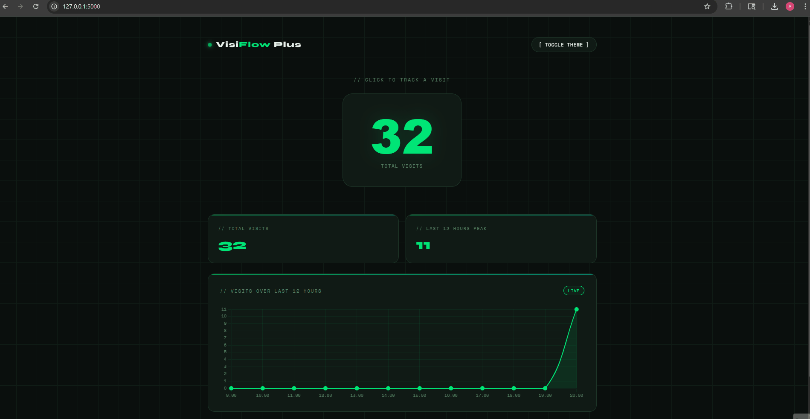

# VisiFlow Plus: Flask + Redis + NGINX 🟢

A multi-container visit tracking dashboard built with Flask, Redis, and Nginx.
Toggle between dark/light mode, click to track visits, and watch analytics update in real time.



---

## Technologies Used

- **Python / Flask** — web framework serving the app and REST endpoints.
- **Redis** — key-value store tracking visit counts and hourly analytics.
- **Nginx** — reverse proxy load balancing traffic to Flask.
- **Docker & Docker Compose** — containerizing and orchestrating all services.
- **Chart.js** — rendering the live visits chart on the frontend.
- **HTML / CSS / JavaScript** — frontend UI with dark/light mode.

---

## Architecture
```
Browser → Nginx:5000 → Flask:5000 → Redis:6379
```

---

## Steps I Took

1. Built a Flask app with `/`, `/count`, and `/analytics` routes
2. Dockerized Flask using a `python:3.8-slim` base image
3. Added Redis as a second container using the official `redis:7-alpine` image
4. Wrote a `docker-compose.yml` to wire both services together
5. Added persistent storage via a named Docker volume for Redis
6. Configured environment variables for `REDIS_HOST` and `REDIS_PORT`
7. Added Nginx as a reverse proxy to sit in front of Flask
8. Built a custom dashboard UI with Chart.js, dark/light mode, and live analytics

---

## Running Locally

**Prerequisites:** Docker + Docker Compose installed
```bash
git clone https://github.com/AbdullahHAbdi/visiflow-plus.git
cd visiflow-plus
docker-compose up --build
```

Then open `http://127.0.0.1:5000` in your browser.

---

## Project Structure
```
flask_redis/
├── app/
│   ├── app.py
│   ├── requirements.txt
│   ├── Dockerfile
│   └── templates/
│       └── index.html
├── redis/
│   └── Dockerfile
├── nginx.conf
├── docker-compose.yml
└── README.md
```